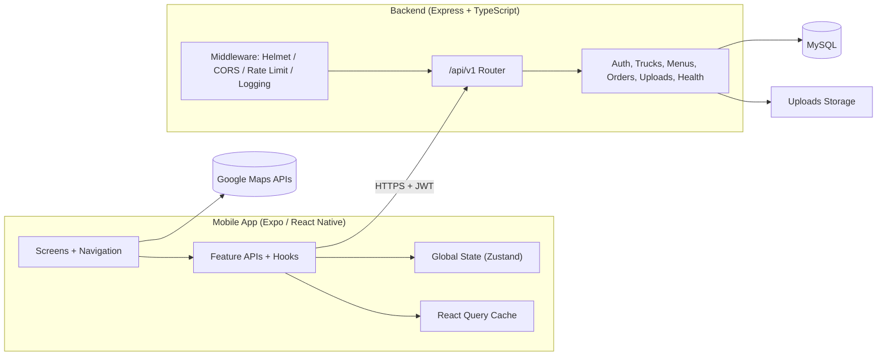
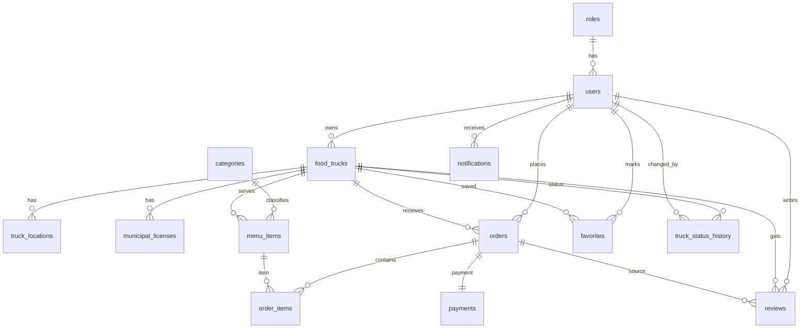
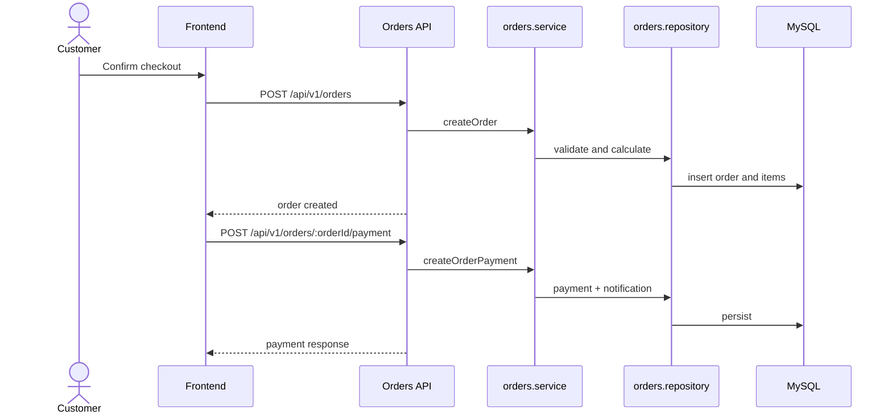
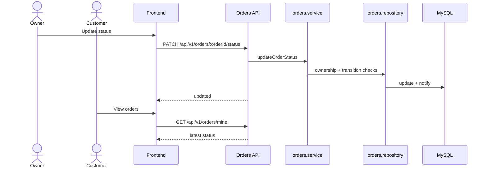
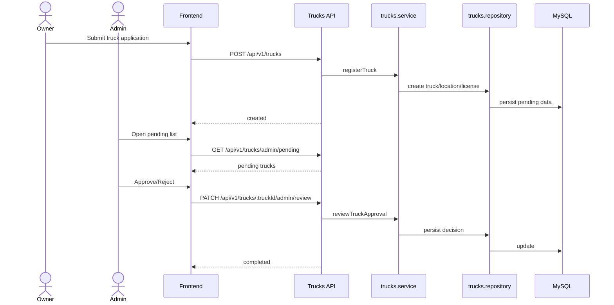
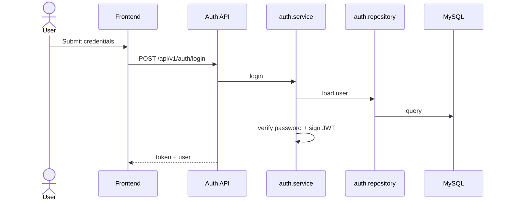

# Stage 3 Technical Documentation
## Food Truck Platform MVP (Current Implemented System)

### Short Outline
1. Project Context
2. User Stories and Functional Mockups (MoSCoW)
3. System Architecture
4. Frontend Architecture
5. Backend Architecture
6. Components / Modules / Responsibilities
7. Database Design
8. Sequence Diagrams
9. API Specifications
10. SCM and QA Plans
11. Technical Justifications
12. Final Deliverable Quality

---

## 1) Project Context

### 1.1 Project Summary
Food Truck Platform is a mobile-first MVP where customers discover food trucks, place pickup orders, and track order updates. Truck owners manage trucks and incoming orders, and admins review/approve truck submissions.

### 1.2 MVP Type
This is a functional MVP implemented in the current repository with:
- role-based authentication and authorization
- truck discovery and details
- owner onboarding and truck review workflow
- menu and order operations
- payment recording in MVP mode
- customer / owner / admin role-specific flows

### 1.3 Core Roles
- Customer
- Truck Owner
- Admin

### 1.4 Core Constraints
- Pickup only (no delivery flow currently implemented)
- Role-based access control (JWT + middleware)
- Order lifecycle with controlled transitions
- Truck approval workflow (owner submission -> admin decision)

### 1.5 Transparency Notes
- Payment is MVP-style (no external PSP callback lifecycle yet).
- Admin incoming-order behavior currently differs from owner incoming-order behavior.

---

## 2) User Stories and Functional Mockups

### 2.1 MoSCoW User Stories

#### Must Have
1. As a customer, I want to discover food trucks, so that I can choose where to order.
2. As a customer, I want to place pickup orders and pay, so that I can complete purchases.
3. As a customer, I want to track order status, so that I know when to pick up.
4. As a truck owner, I want to submit truck onboarding details, so that admin can review my truck.
5. As a truck owner, I want to update incoming order statuses, so that customers see progress.
6. As an admin, I want to review pending trucks, so that only approved trucks go live.

#### Should Have
1. As a customer, I want map-based discovery, so that I can find nearby trucks faster.
2. As an owner, I want profile/location/status updates, so that truck data stays accurate.
3. As an authenticated user, I want profile/password management, so that my account stays secure.

#### Could Have
1. As a customer, I want favorite trucks for quick reuse (schema exists; API module not currently mounted).
2. As a customer, I want to submit reviews after pickup completion.

#### Won't Have (Current MVP Scope)
- Full external payment gateway callback orchestration
- Delivery logistics workflow

### 2.2 Functional Mockups
Current implemented screens act as functional mockups:
- Splash/Auth/Profile
- customer tabs + discovery screens
- Cart/Checkout/PaymentSuccess
- owner onboarding/incoming orders screens
- admin panel review screen

---

## 3) System Architecture

### 3.1 Real Stack
- Frontend: Expo, React Native, TypeScript, React Navigation, React Query, Zustand, Axios
- Backend: Node.js, Express, TypeScript, Knex, Zod, JWT, bcryptjs, Multer, Pino
- Database: MySQL
- External service: Google Maps APIs

### 3.2 High-Level Architecture Diagram


### 3.3 Data Flow
1. App sends requests to `/api/v1/*`.
2. Global middleware executes.
3. Auth/RBAC middleware validates access.
4. Controller validates request (Zod).
5. Service applies business rules.
6. Repository runs Knex queries.
7. API returns standardized JSON envelope.

---

## 4) Frontend Architecture

### 4.1 Real Structure
- `src/api`: client, envelope, query setup, network error handling
- `src/features`: `auth`, `trucks`, `orders`, `menus`, `admin`, `checkout`
- `src/screens`: route-level screens
- `src/ui`: shared reusable UI
- `src/navigation`: root stack and role-based tabs
- `src/store`: auth/cart global state
- `src/theme`: design tokens
- `src/config`: runtime config
- `src/utils`: helper utilities
- `src/assets`: static assets

### 4.2 Layer Separation
- Shared UI: reusable generic components
- Feature components: domain-focused UI blocks
- Route-level screens: full page compositions
- Global state: cross-screen app state
- API layer: typed backend communication boundary

### 4.3 Frontend Structure Tree
```text
frontend/                              # Mobile application workspace
├── App.tsx                            # Root app component (providers + root navigation)
├── src/                               # Main source directory
│   ├── api/                           # Shared HTTP client, envelope types, query client
│   ├── assets/                        # Static app assets (images/icons)
│   ├── config/                        # Runtime app configuration
│   ├── features/                      # Domain-based feature modules
│   │   ├── admin/                     # Admin API calls and admin UI components
│   │   ├── auth/                      # Authentication and account APIs
│   │   ├── checkout/                  # Checkout-related feature components
│   │   ├── menus/                     # Menu/category API integration
│   │   ├── orders/                    # Order creation, payment, status, review flows
│   │   └── trucks/                    # Discovery/details/owner truck operations
│   ├── navigation/                    # Root stack + role-based tabs
│   ├── screens/                       # Route-level screens
│   │   ├── admin/                     # Admin panel screens
│   │   ├── auth/                      # Splash/login/profile screens
│   │   ├── cart/                      # Cart screen
│   │   ├── checkout/                  # Checkout and payment success screens
│   │   ├── home/                      # Home and map discovery screens
│   │   ├── orders/                    # Customer/owner order tracking screens
│   │   ├── owner/                     # Owner dashboard/onboarding screens
│   │   └── truck/                     # Truck details screen
│   ├── store/                         # Zustand global state stores (auth/cart)
│   ├── theme/                         # Design tokens (colors, spacing, typography)
│   ├── ui/                            # Shared reusable UI components
│   └── utils/                         # Cross-feature utility helpers
└── README.md                          # Frontend setup and architecture guide
```

---

## 5) Backend Architecture

### 5.1 Real Structure
- `config`: environment config
- `core`: DB, errors, HTTP middleware/helpers, logger, shared types
- `modules/shared`: role/status constants
- `modules`: `auth`, `trucks`, `menus`, `orders`, `uploads`, `health`
- `routes.ts`: composed API surface
- `database`: migrations, seeds, schema docs

### 5.2 Processing Flow
`route -> controller -> service -> repository -> db`

### 5.3 Error/Auth/RBAC/Validation
- central app error catalog + global error handler
- JWT authentication middleware
- role-based authorization middleware
- Zod validation at API boundary

### 5.4 Backend Structure Tree
```text
backend/                               # API server workspace
├── src/                               # Main backend source
│   ├── app.ts                         # Express app setup (middleware + API mounting)
│   ├── server.ts                      # Server entry point (listen/start)
│   ├── routes.ts                      # Top-level route composition (/api/v1 modules)
│   ├── config/                        # Environment config parsing/validation
│   ├── core/                          # Cross-cutting infrastructure
│   │   ├── db/                        # Database connection and shared DB utilities
│   │   ├── errors/                    # Error catalog, custom app errors, error mapping
│   │   ├── http/                      # API response helpers and HTTP utilities
│   │   │   └── middleware/            # Auth, RBAC, not-found, global error middleware
│   │   ├── logger/                    # Structured logging setup
│   │   └── types/                     # Shared backend TypeScript types
│   ├── database/                      # Persistent schema artifacts
│   │   ├── migrations/                # Knex schema evolution scripts
│   │   ├── seeds/                     # Seed data scripts for local/dev setup
│   │   ├── schema.sql                 # SQL snapshot/reference
│   │   └── erd.md                     # ER design reference notes
│   └── modules/                       # Domain modules (vertical slices)
│       ├── auth/                      # Identity/authentication/account module
│       ├── health/                    # Health-check endpoint module
│       ├── menus/                     # Menu/category domain module
│       ├── orders/                    # Order lifecycle and payment/review module
│       ├── shared/                    # Shared domain constants (roles/statuses)
│       ├── trucks/                    # Truck discovery/management/approval module
│       └── uploads/                   # File upload handling module
└── README.md                          # Backend setup and architecture guide
```

---

## 6) Components / Modules / Responsibilities

### 6.1 Backend Modules
| Module | Responsibility | Current Scope |
|--------|----------------|---------------|
| `auth` | identity and account management | register/login/profile/password/admin-create |
| `trucks` | truck lifecycle management | discovery/details/owner updates/admin review |
| `menus` | menu domain operations | categories + menu CRUD |
| `orders` | order lifecycle operations | create/pay/review/incoming/status/notifications |
| `admin` | admin capabilities | represented by admin-only routes in trucks/auth |
| `uploads` | file upload operations | protected single-upload endpoint |

### 6.2 Frontend Features
| Frontend Feature | Responsibility |
|------------------|----------------|
| `features/auth` | auth and profile API integration |
| `features/trucks` | truck discovery/details/owner operations |
| `features/orders` | create/pay/track/update/review flows |
| `features/menus` | menu/category API usage |
| `features/admin` | pending review and admin operations |
| `features/checkout` | checkout payment-method UI blocks |

---

## 7) Database Design

### 7.1 Database Design Rationale
- MySQL supports relational integrity for transactional workflows.
- Knex migrations provide repeatable schema evolution.
- Schema is domain-separated for maintainability.

### 7.2 Real Core Tables
`roles`, `users`, `food_trucks`, `truck_locations`, `municipal_licenses`, `categories`, `menu_items`, `orders`, `order_items`, `payments`, `notifications`, `favorites`, `reviews`, `truck_status_history`

### 7.3 ER Diagram
Reading guide:
- `||--o{` means one-to-many.
- `||--||` means one-to-one.
- Relationship labels (for example `owns`, `receives`) describe business meaning, not SQL column names.



### 7.4 Schema Summary
| Table | Purpose | Primary Key | Foreign Keys | Unique Constraints | Status / Enum Fields |
|-------|---------|-------------|--------------|--------------------|----------------------|
| `roles` | Master list of platform roles | `id` | - | `code` | - |
| `users` | User accounts and identity data | `id` | `role_id -> roles.id` | `email`, `phone` | `is_active` |
| `food_trucks` | Core truck profile owned by a user | `id` | `owner_user_id -> users.id`, `category_id -> categories.id` | `slug` | `approval_status`, `operational_status` |
| `truck_locations` | Current/historical truck coordinates and area info | `id` | `truck_id -> food_trucks.id` | - | `is_current` |
| `municipal_licenses` | License data used in admin review workflow | `id` | `truck_id -> food_trucks.id`, `reviewed_by -> users.id` | `license_number` | `review_status` |
| `categories` | Menu/truck category catalog | `id` | - | `slug` | - |
| `menu_items` | Sellable items offered by a truck | `id` | `truck_id -> food_trucks.id`, `category_id -> categories.id` | - | `is_available` |
| `orders` | Customer pickup order header/summary | `id` | `customer_user_id -> users.id`, `truck_id -> food_trucks.id` | `order_number` | `status` |
| `order_items` | Line items under each order | `id` | `order_id -> orders.id`, `menu_item_id -> menu_items.id` | - | - |
| `payments` | Payment record linked to an order | `id` | `order_id -> orders.id` | `order_id` | `method`, `status` |
| `notifications` | User notifications (order/system/admin events) | `id` | `user_id -> users.id` | - | `type`, `is_read` |
| `favorites` | Customer saved trucks (future API scope) | `id` | `user_id -> users.id`, `truck_id -> food_trucks.id` | `(user_id, truck_id)` | - |
| `reviews` | Customer ratings/comments for trucks/orders | `id` | `user_id -> users.id`, `truck_id -> food_trucks.id`, `order_id -> orders.id` | - | `rating` |
| `truck_status_history` | Audit trail of truck operational status changes | `id` | `truck_id -> food_trucks.id`, `changed_by_user_id -> users.id` | - | `status` |

### 7.5 Future Scope Note
- `favorites` exists in schema but is not currently mounted as a backend API module.

---

## 8) Sequence Diagrams

### 8.1 Customer Creates Order and Payment
Why it matters: this is the primary revenue path and combines order creation with MVP payment recording.



### 8.2 Owner Updates Order Status and Customer Sees Progress
Why it matters: this diagram demonstrates the operational loop between owner actions and customer visibility.



### 8.3 Owner Submits Truck and Admin Reviews It
Why it matters: this is the governance flow that controls marketplace quality and eligibility.



### 8.4 Optional Important Flow: Login
Why it matters: this flow gates all protected operations through identity and role context.



---

## 9) API Specifications

### 9.1 External APIs / Services
| Service | Usage |
|---------|-------|
| Google Maps APIs | map rendering and location-based discovery |

### 9.2 Internal APIs (Base Path: `/api/v1`)
Reading guide:
- **Authenticated** means Bearer JWT is required.
- **Truck Owner/Admin** means RBAC middleware allows either role.
- Endpoints below are documented from the currently mounted backend routers.

#### Health
| Method | Endpoint | Auth / Role | Request body / params | Response summary |
|--------|----------|-------------|------------------------|------------------|
| GET | `/health` | Public | none | service health |

#### Auth
| Method | Endpoint | Auth / Role | Request body / params | Response summary |
|--------|----------|-------------|------------------------|------------------|
| POST | `/auth/register` | Public | registration fields | account created |
| POST | `/auth/login` | Public | credentials | token + user |
| GET | `/auth/me` | Authenticated | none | current profile |
| PATCH | `/auth/me` | Authenticated | profile fields | updated profile |
| PATCH | `/auth/me/password` | Authenticated | password fields | password updated |
| POST | `/auth/admin/register` | Admin | admin fields | admin account created |

#### Trucks
| Method | Endpoint | Auth / Role | Request body / params | Response summary |
|--------|----------|-------------|------------------------|------------------|
| GET | `/trucks/discovery` | Public | query filters | trucks list |
| GET | `/trucks/:truckId/details` | Public | truck id | truck details |
| POST | `/trucks` | Truck Owner | truck payload | created |
| GET | `/trucks/mine` | Truck Owner/Admin | none | owned/visible trucks |
| GET | `/trucks/mine/notifications` | Truck Owner | none | owner notifications |
| GET | `/trucks/mine/draft` | Truck Owner | none | latest draft |
| PATCH | `/trucks/:truckId/profile` | Truck Owner/Admin | profile payload | updated |
| PATCH | `/trucks/:truckId/location` | Truck Owner/Admin | location payload | updated |
| PATCH | `/trucks/:truckId/status` | Truck Owner/Admin | status payload | updated |
| GET | `/trucks/admin/pending` | Admin | none | pending reviews |
| GET | `/trucks/admin/stats` | Admin | none | admin stats |
| PATCH | `/trucks/:truckId/admin/review` | Admin | review payload | review result |
| DELETE | `/trucks/:truckId` | Truck Owner/Admin | truck id | removed/deactivated |

#### Menus
| Method | Endpoint | Auth / Role | Request body / params | Response summary |
|--------|----------|-------------|------------------------|------------------|
| GET | `/menus/categories` | Truck Owner/Admin | none | categories |
| GET | `/menus` | Truck Owner/Admin | `truckId` query | menu items |
| POST | `/menus` | Truck Owner/Admin | menu payload | created |
| PATCH | `/menus/:menuItemId` | Truck Owner/Admin | update payload | updated |
| DELETE | `/menus/:menuItemId` | Truck Owner/Admin | item id | removed |

#### Orders
| Method | Endpoint | Auth / Role | Request body / params | Response summary |
|--------|----------|-------------|------------------------|------------------|
| POST | `/orders` | Customer | order payload | order created |
| GET | `/orders/mine` | Customer | none | customer orders |
| GET | `/orders/mine/notifications` | Customer | none | customer notifications |
| POST | `/orders/:orderId/payment` | Customer | payment method | payment recorded |
| POST | `/orders/:orderId/review` | Customer | review payload | review created |
| GET | `/orders/incoming` | Truck Owner/Admin | none | incoming orders |
| PATCH | `/orders/:orderId/status` | Truck Owner/Admin | status payload | status updated |

#### Uploads
| Method | Endpoint | Auth / Role | Request body / params | Response summary |
|--------|----------|-------------|------------------------|------------------|
| POST | `/uploads/single` | Truck Owner/Admin | multipart file | file metadata |

### 9.3 Integration TODO
- Frontend currently calls `/admin/stats` while backend exposes `/trucks/admin/stats`.
- Endpoint alignment is required.

---

## 10) SCM and QA Plans

### 10.1 SCM Strategy
- Git with short-lived feature branches
- pull-request based merges
- mandatory code review
- scoped commits with clear messages

### 10.2 Recommended Commit Convention
- `feat(scope): ...`
- `fix(scope): ...`
- `refactor(scope): ...`
- `docs(scope): ...`
- `test(scope): ...`

### 10.3 QA Strategy

#### Unit Tests
- Current: no explicit unit-test scripts in package manifests.
- Plan: add service-level unit tests for auth/orders/trucks logic.

#### Integration Tests
- Current: manual API validation.
- Plan: add automated API integration tests for critical flows.

#### Manual Smoke Tests
1. Login with customer/owner/admin
2. Customer discovery -> checkout -> payment
3. Owner updates incoming order status
4. Admin reviews pending truck

#### E2E Candidate Flows
1. Customer full order lifecycle
2. Owner order handling lifecycle
3. Owner submission + admin review lifecycle

#### Lint and Type Checks
- Frontend: `npm run lint`, `npx tsc --noEmit`
- Backend: `npm run lint`, TypeScript build checks

---

## 11) Technical Justifications

| Technology / Pattern | Justification |
|----------------------|---------------|
| React Native Expo | fast cross-platform mobile delivery |
| Express + TypeScript | modular backend and type safety |
| MySQL | strong relational integrity |
| Knex | migration-based schema lifecycle |
| Zod | reliable runtime validation |
| Zustand | lightweight global state |
| React Query | robust server-state management |
| REST JSON envelope | consistent API contract |
| Role-based architecture | direct match to customer/owner/admin model |
| Modular structure | maintainable domain separation |

---

## 12) Final Stage 3 Deliverable Quality

This report is:
- English only
- non-duplicated
- grounded in current implementation
- aligned with Stage 3 deliverable requirements
- ready for supervisor review and presentation

Included visual artifacts:
1. High-level architecture diagram
2. Frontend structure tree
3. Backend structure tree
4. ER diagram
5. Sequence diagrams

It explicitly marks current limitations/TODOs and avoids unsupported assumptions.
