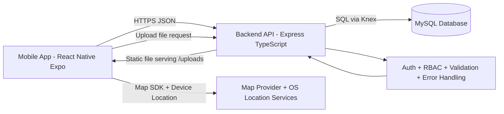
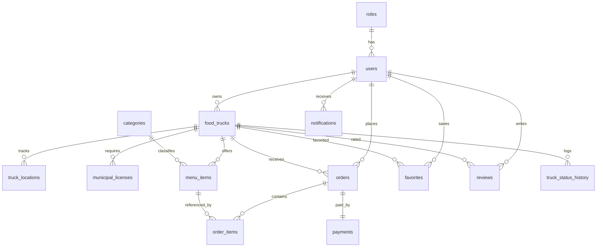
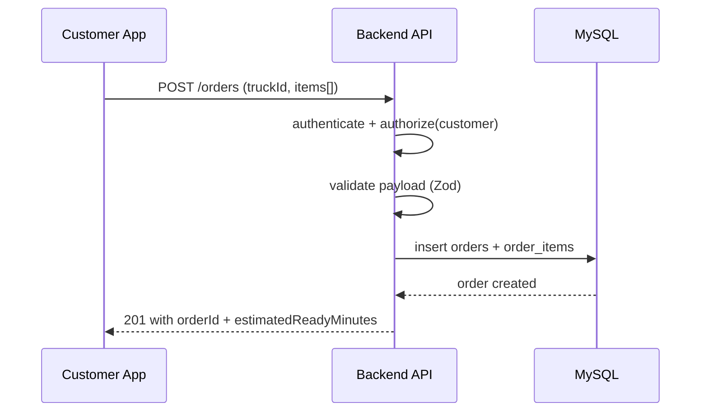
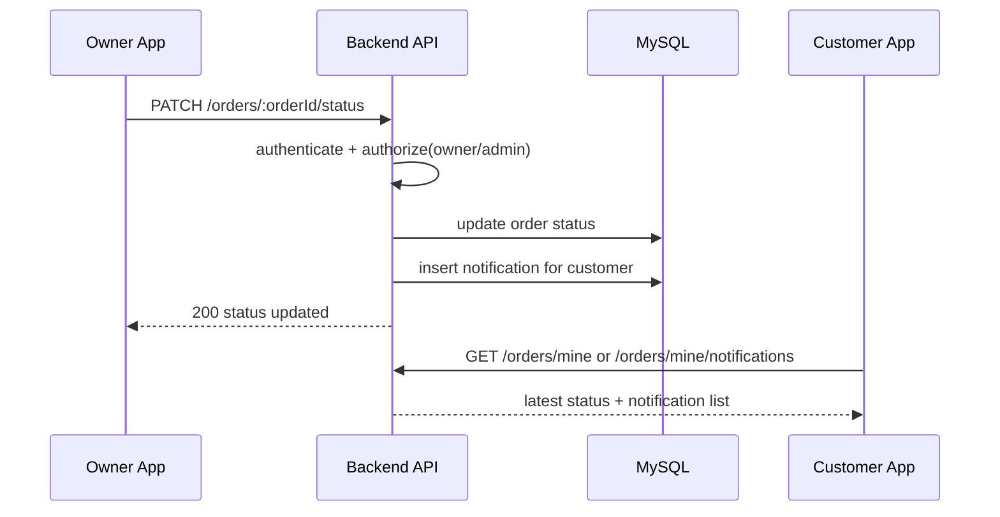
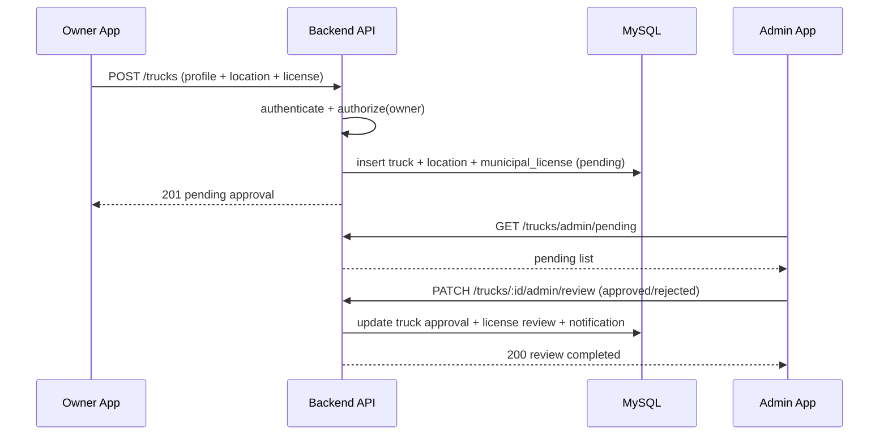

# Stage 3 Technical Documentation

## Project Context

This document defines the Stage 3 technical blueprint for the Food Truck Platform MVP (pickup only).  
It is aligned with the implemented stack and repository structure:

- Frontend: React Native (Expo) + React Navigation + React Query + Zustand.
- Backend: Node.js + Express + TypeScript + Knex + Zod.
- Database: MySQL.
- API style: REST JSON envelope (`success`, `message`, `data`).

---

## 0) User Stories and Mockups

### 0.1 Prioritized User Stories (MoSCoW)

#### Must Have

1. As a customer, I want to discover approved nearby food trucks on a map, so that I can choose a pickup option quickly.
2. As a customer, I want to view truck details and menu items, so that I can decide what to order.
3. As a customer, I want to create an order and pay, so that I can receive my pickup order number and ETA.
4. As a customer, I want to track order status (pending, preparing, ready, picked_up), so that I know when to pick up.
5. As a truck owner, I want to submit my truck profile, location, and municipal license, so that my truck can be reviewed.
6. As an admin, I want to review pending trucks and approve/reject with notes, so that only compliant trucks are published.
7. As a truck owner, I want to update incoming order status, so that customers receive accurate pickup readiness updates.
8. As a user, I want secure authentication and role-based access, so that each role accesses only authorized actions.

#### Should Have

1. As a truck owner, I want to manage menu items (add/edit/delete), so that I can keep my offerings updated.
2. As a customer, I want to submit a review after pickup, so that I can rate my experience.
3. As an admin, I want dashboard stats for pending/approved/rejected trucks, so that moderation workload is visible.

#### Could Have

1. As a customer, I want to save favorite trucks, so that I can reorder faster.
2. As a truck owner, I want better operational analytics, so that I can optimize prep time.

#### Won't Have (MVP)

1. Delivery and driver dispatch.
2. Multi-language UI.
3. Advanced AI recommendations.
4. Full realtime socket infrastructure (polling is acceptable for MVP).

### 0.2 Mockups (Applicable)

The project includes a mobile UI, so mockups are applicable.  
At this stage, implemented screens act as functional mockups/wireframes:

- Customer flow screens:
  - `src/screens/home/customer-map-screen.tsx`
  - `src/screens/home/map-discovery-screen.tsx`
  - `src/screens/truck/truck-details-screen.tsx`
  - `src/screens/cart/cart-screen.tsx`
  - `src/screens/checkout/checkout-screen.tsx`
  - `src/screens/orders/orders-screen.tsx`
  - `src/screens/orders/order-details-screen.tsx`
- Owner flow screens:
  - `src/screens/owner/owner-onboarding-screen.tsx`
  - `src/screens/owner/owner-dashboard-screen.tsx`
  - `src/screens/owner/owner-incoming-orders-screen.tsx`
- Admin flow screens:
  - `src/screens/admin/admin-panel-screen.tsx`

Recommended presentation note: attach 3-5 screenshot frames (Customer Map, Truck Details, Owner Onboarding, Incoming Orders, Admin Review) as visual mockups in final presentation slides.

---

## 1) System Architecture

### 1.1 High-Level Architecture Diagram



### 1.2 Data Flow (Key)

1. Mobile app sends request to `/api/v1/...`.
2. Backend middleware chain applies security (`helmet`, CORS, rate-limit), auth (JWT), and role authorization.
3. Zod validators enforce input shape.
4. Service/repository layers execute business rules and DB queries via Knex.
5. Standard JSON response envelope is returned to frontend.

### 1.3 Architecture Style

- Modular monolith with domain modules:
  - `auth`, `trucks`, `menus`, `orders`, `admin`, `uploads`.
- Layered boundaries:
  - route -> controller -> service -> repository -> DB.
- Shared cross-cutting concerns:
  - Validation, logging, standardized API responses, centralized error handling.

---

## 2) Components, Classes, and Database Design

### 2.1 Backend Components (Module Responsibilities)

- Auth Module:
  - Registration/login/profile/password update.
  - Token issuance and identity extraction for protected routes.
- Trucks Module:
  - Truck onboarding submission.
  - Discovery listing and detailed truck view.
  - Owner updates (profile/location/status).
  - Admin review workflow (approve/reject).
- Menus Module:
  - Owner/admin category listing and menu item CRUD.
- Orders Module:
  - Customer order creation.
  - Payment record creation.
  - Owner/admin status transitions.
  - Customer notifications and review submission.
- Admin Module:
  - Moderation stats endpoint.
- Uploads Module:
  - Authenticated file upload and public static URL generation.

### 2.2 Main Backend "Class-Level" Design (Logical)

Although code is function-oriented, logical classes/components are:

1. `AuthController`, `AuthService`, `AuthRepository`
2. `TrucksController`, `TrucksService`, `TrucksRepository`
3. `MenusController`, `MenusService`, `MenusRepository`
4. `OrdersController`, `OrdersService`, `OrdersRepository`
5. Shared infrastructure:
   - `authenticate` middleware
   - `authorizeRoles` middleware
   - `AppError`
   - response builders (`ok`, `fail`)

### 2.3 Frontend Component Architecture

- Navigation:
  - Root stack + tab navigation.
- Feature APIs:
  - `features/auth/api`, `features/trucks/api`, `features/orders/api`, `features/menus/api`, `features/admin/api`.
- Screen composition:
  - Role-based screens (customer/owner/admin) with reusable UI components.
- State:
  - React Query for server state.
  - Zustand for local auth/cart state.

### 2.4 Database Design (MySQL)

Core tables:

1. `roles`
2. `users`
3. `food_trucks`
4. `truck_locations`
5. `municipal_licenses`
6. `categories`
7. `menu_items`
8. `orders`
9. `order_items`
10. `payments`
11. `notifications`
12. `favorites`
13. `reviews`
14. `truck_status_history`

### 2.5 ER Diagram (High-Level)



### 2.6 Key Schema Constraints

- Unique: user email, user phone, truck slug, order number, license number.
- FK integrity across all domain relationships.
- Order/payment split keeps payment lifecycle decoupled from order lifecycle.
- Status enums enforce valid transitions for trucks/orders/payments/licenses.

---

## 3) High-Level Sequence Diagrams

### 3.1 Use Case A - Customer Creates Pickup Order



### 3.2 Use Case B - Owner Updates Order Status



### 3.3 Use Case C - Owner Onboarding and Admin Review



---

## 4) External and Internal APIs

### 4.1 External Services / APIs

1. Map and geolocation stack:
   - `react-native-maps` + device location (`expo-location`).
   - Purpose: discover nearby trucks, set owner truck location, open map coordinates.
2. Optional future payment gateway integration (currently internal payment record simulation in MVP):
   - candidates: Mada/STC Pay/card processor APIs.
   - Purpose: replace mock payment creation with real authorization/capture.

### 4.2 Internal API Conventions

- Base URL: `/api/v1`
- Auth: `Authorization: Bearer <token>` for protected routes.
- Response success envelope:

```json
{
  "success": true,
  "message": "Operation successful",
  "data": {}
}
```

### 4.3 Internal API Endpoints (MVP)

| Domain | Method | Endpoint | Auth/Role | Input (summary) | Output (summary) |
|---|---|---|---|---|---|
| Health | GET | `/health` | Public | - | service status |
| Auth | POST | `/auth/register` | Public | fullName, email, phone, password, roleCode | userId |
| Auth | POST | `/auth/login` | Public | email, password | accessToken, user |
| Auth | GET | `/auth/me` | Any authenticated | - | current user profile |
| Auth | PATCH | `/auth/me` | Any authenticated | fullName, email, phone | updated profile |
| Auth | PATCH | `/auth/me/password` | Any authenticated | currentPassword, newPassword | success message |
| Auth | POST | `/auth/admin/register` | Admin | admin profile payload | created admin |
| Trucks | GET | `/trucks/discovery` | Public | optional city, neighborhood, categoryId | truck list |
| Trucks | GET | `/trucks/:truckId/details` | Public | path truckId | truck details + menu |
| Trucks | POST | `/trucks` | Truck Owner | profile + location + license | truckId, approvalStatus |
| Trucks | GET | `/trucks/mine` | Owner/Admin | - | owner trucks |
| Trucks | GET | `/trucks/mine/notifications` | Owner | - | owner notifications |
| Trucks | GET | `/trucks/mine/draft` | Owner | - | latest truck draft |
| Trucks | PATCH | `/trucks/:truckId/profile` | Owner/Admin | profile fields | success |
| Trucks | PATCH | `/trucks/:truckId/location` | Owner/Admin | latitude, longitude, neighborhood, city | success |
| Trucks | PATCH | `/trucks/:truckId/status` | Owner/Admin | status | success |
| Trucks | GET | `/trucks/admin/pending` | Admin | - | pending truck list |
| Trucks | PATCH | `/trucks/:truckId/admin/review` | Admin | decision, reviewNote? | reviewed status |
| Trucks | DELETE | `/trucks/:truckId` | Owner/Admin | path truckId | success |
| Menus | GET | `/menus/categories` | Owner/Admin | - | categories |
| Menus | GET | `/menus` | Owner/Admin | truckId query | menu items |
| Menus | POST | `/menus` | Owner/Admin | truckId, categoryId, name, price, ... | created item |
| Menus | PATCH | `/menus/:menuItemId` | Owner/Admin | partial fields | updated item |
| Menus | DELETE | `/menus/:menuItemId` | Owner/Admin | path menuItemId | success |
| Orders | POST | `/orders` | Customer | truckId, items[] | orderId, ETA |
| Orders | GET | `/orders/mine` | Customer | - | customer orders |
| Orders | GET | `/orders/mine/notifications` | Customer | - | notifications |
| Orders | POST | `/orders/:orderId/payment` | Customer | method | payment result |
| Orders | POST | `/orders/:orderId/review` | Customer | rating, comment? | reviewId |
| Orders | GET | `/orders/incoming` | Owner/Admin | - | incoming orders |
| Orders | PATCH | `/orders/:orderId/status` | Owner/Admin | status | updated order |
| Uploads | POST | `/uploads/single` | Owner/Admin | multipart file | file URL |
| Admin | GET | `/admin/stats` | Admin | - | moderation statistics |

---

## 5) SCM and QA Strategy

### 5.1 Source Control Management (SCM)

Recommended branch model:

- `main`: production-ready stable branch.
- `develop`: integration branch for upcoming release.
- `feature/<scope-name>`: feature development per task.
- `hotfix/<issue>`: urgent production fixes.

Process:

1. Create issue/task and branch from `develop`.
2. Commit in small logical units with clear messages.
3. Open PR to `develop` with checklist and test evidence.
4. Require at least 1 reviewer approval before merge.
5. Rebase/merge from `develop` regularly to reduce conflicts.
6. Release by merging `develop` into `main` using tagged version.

Commit convention (recommended):

- `feat: ...`, `fix: ...`, `refactor: ...`, `test: ...`, `docs: ...`, `chore: ...`

### 5.2 QA Strategy

Testing pyramid for MVP:

1. Unit tests:
   - validation schemas
   - service-level business logic
2. Integration tests:
   - API endpoints with DB test dataset
   - auth and role-guard scenarios
3. Manual E2E smoke tests:
   - customer order flow
   - owner onboarding + status updates
   - admin review workflow

Tools:

- Backend: Jest/Vitest + supertest (recommended next step).
- API validation: Postman collections.
- Frontend: manual QA checklists on Expo app + optional Detox in later phase.
- Static checks: ESLint (`frontend`, `backend`) before PR merge.

Quality gates (minimum):

- Lint passes.
- No critical bug in 3 core flows (customer order, owner onboarding, admin review).
- Basic regression run on authenticated endpoints after each merge.

### 5.3 Deployment and Environments

- Local:
  - backend + MySQL Docker + Expo app.
- Staging:
  - mirror of production config for acceptance testing.
- Production:
  - protected secrets, environment validation at startup, monitoring logs.

---

## 6) Technical Justifications

1. React Native (Expo) for a single codebase mobile MVP with fast iteration.
2. Express + TypeScript for simple, maintainable modular monolith architecture.
3. MySQL chosen for strong relational integrity across orders/payments/reviews and clear SQL indexing.
4. Knex selected to keep SQL control with migration lifecycle without heavy ORM overhead.
5. Zod validation at module boundaries reduces invalid payloads and runtime bugs.
6. RBAC (`admin`, `truck_owner`, `customer`) is mandatory due to role-specific operations.
7. Modular domain structure reduces coupling and supports incremental scaling by module.
8. Standard API envelope simplifies frontend error/success handling consistency.
9. Pickup-only design intentionally reduces scope complexity and delivery logistics risk for MVP timeline.

---

## 7) Stage 3 Checklist Mapping

- User Stories and Mockups: Completed.
- System Architecture: Completed (diagram + flow).
- Components/Classes/Database: Completed (modules + ERD + schema logic).
- Sequence Diagrams: Completed (3 critical use cases).
- API Specifications: Completed (external + internal endpoints).
- SCM and QA Plans: Completed.
- Technical Justifications: Completed.

This document is ready as the Stage 3 technical deliverable and can be presented directly to supervisors.
